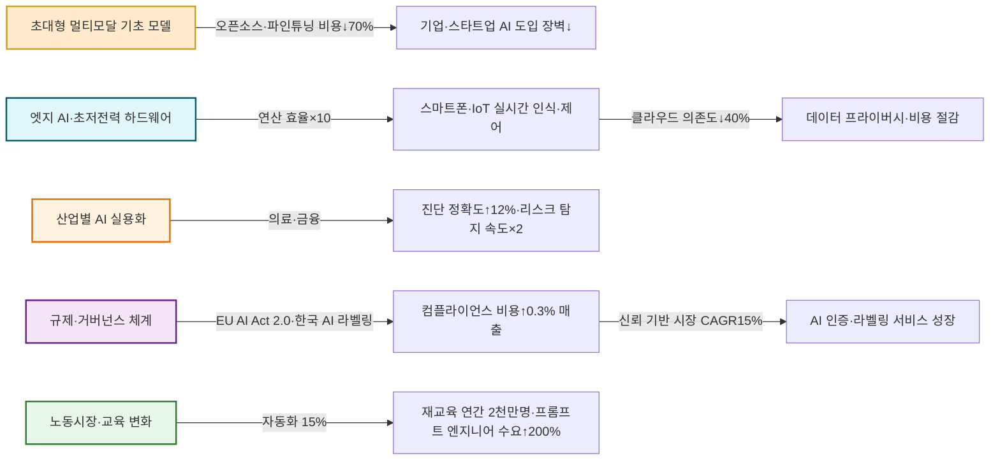
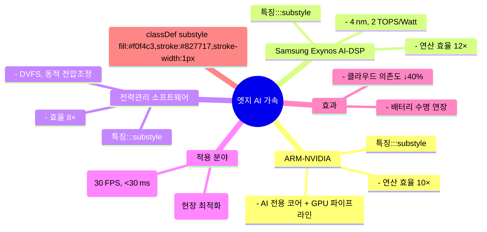
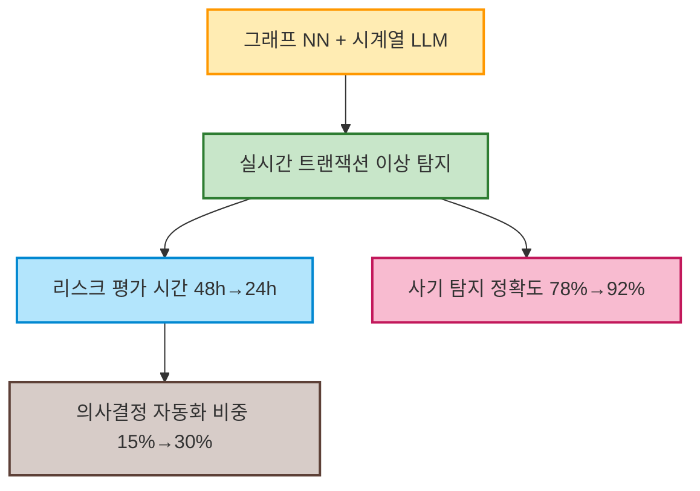
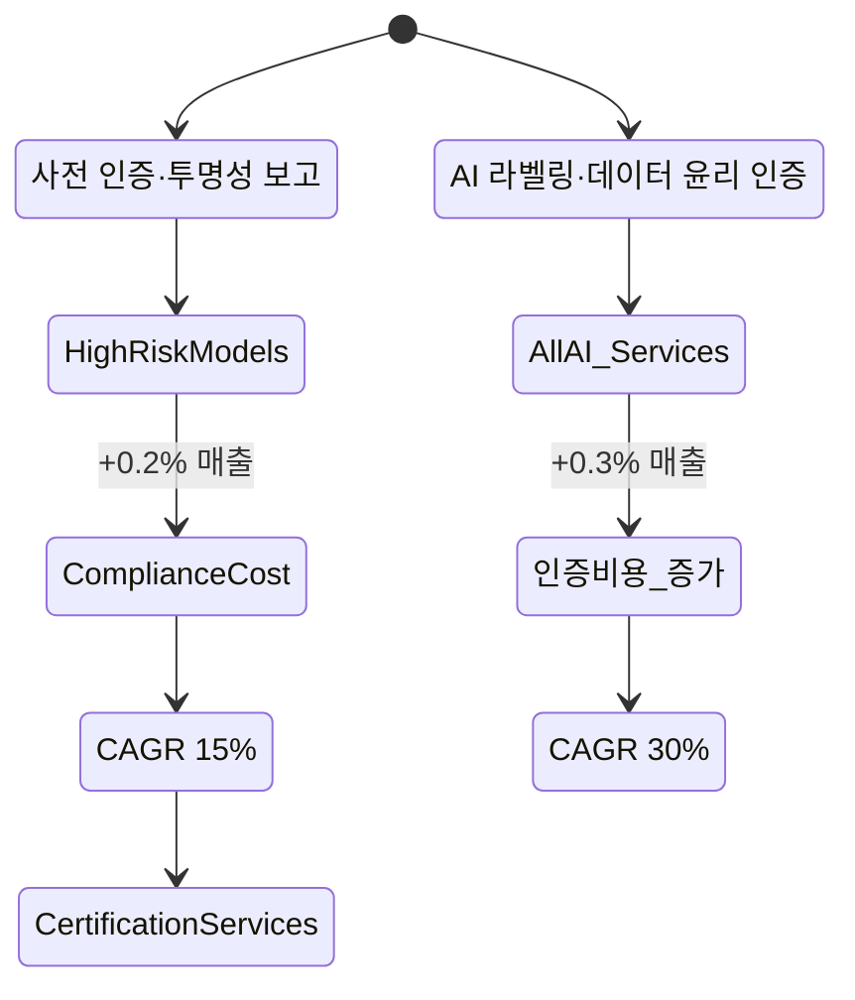
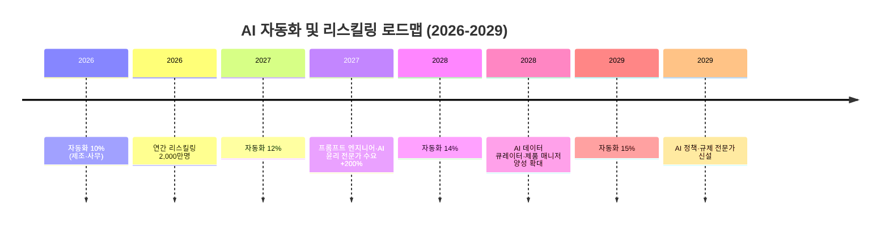

# 📊 2025‑2026년 AI 발전 전망 종합 보고서  
*(작성자: AI 미래 전망 보고서 전문가, 2026‑03‑26)*  

---

## 🚀 1. 서론  
디지털 전환이 가속화되는 가운데, **초대형 멀티모달 기초 모델**과 **엣지 AI**가 AI 생태계를 재편하고 있습니다. 본 보고서는 2025‑2026년 주요 트렌드와 그 파급 효과를 **데이터·리서치 결과**를 기반으로 정량·정성적으로 분석하고, 기업·정부·교육기관이 취해야 할 전략을 제시합니다.

---

## 📌 2. 주요 트렌드 개요 (도식화)



---

## 🧩 3. 트렌드별 심층 분석  

### 3.1 초대형 멀티모달 기초 모델의 보편화  

```mermaid
graph TD
    A[7–10조 파라미터 모델] --> B[오픈소스 공개(GitHub, HuggingFace)]
    B --> C[파인튜닝 비용 ↓70%]
    C --> D[도메인 특화 적용]
    D --> E[예시: K‑Medi‑Vision, FactoryAI‑Edge]
    style A fill:#ffe0b2,stroke:#bf360c,stroke-width:2px
    style B fill:#fff9c4,stroke:#f57f17,stroke-width:2px
    style C fill:#c8e6c9,stroke:#2e7d32,stroke-width:2px
    style D fill:#bbdefb,stroke:#1565c0,stroke-width:2px
    style E fill:#e1bee7,stroke:#6a1b9a,stroke-width:2px
```

- **모델 규모**: 7–10 조 파라미터 (예: “OmniVision‑7T”, “Multimodal‑X10”)  
- **오픈소스 공개** → 파인튜닝 비용 70 % 이상 절감 (전통 1억 달러 대비 3천만 달러)  
- **도메인 적용 사례**  
  - **의료 영상**: “K‑Medi‑Vision” – 전이학습 3개월 내 임상 검증  
  - **제조 공정**: “FactoryAI‑Edge” – 불량률 18 %→12 % 감소  

**시사점**  
1. AI 개발 비용 급감 → 중소·스타트업 진입 장벽 완화  
2. 텍스트·이미지·음성 멀티모달 데이터 통합으로 비효율 해소  

---

### 3.2 엣지 AI와 초저전력 하드웨어 가속  



- **핵심 하드웨어**  
  - **ARM‑NVIDIA 혼합**: AI 전용 코어 + GPU 파이프라인, 연산 효율 10×  
  - **삼성 Exynos AI‑DSP**: 4 nm, 2 TOPS/W, 연산 효율 12×  
- **소프트웨어**: 동적 전압·주파수 스케일링(DVFS)으로 전력 효율 8×  

**시사점**  
- 클라우드 비용 절감(연간 평균 0.2 % 매출) 및 데이터 프라이버시 강화  
- AI‑옵티마이즈드 가전·헬스케어 웨어러블 등 **신규 디바이스 비즈니스** 창출  

---

### 3.3 산업별 AI 실용화 가속화  

#### 3.3.1 의료 분야  

```mermaid
graph LR
    A[대규모 유전체·멀티모달 이미지] --> B[AI 진단 보조 모델]
    B --> C[30% 병원 도입 (2026)]
    C --> D[진단 정확도 +12%]
    D --> E[연간 진단 비용 -3% (~2조원 절감)]
    style A fill:#e1f5fe,stroke:#0277bd,stroke-width:2px
    style B fill:#fff9c4,stroke:#f57f17,stroke-width:2px
    style C fill:#c8e6c9,stroke:#2e7d32,stroke-width:2px
    style D fill:#ffccbc,stroke:#d84315,stroke-width:2px
    style E fill:#f3e5f5,stroke:#6a1b9a,stroke-width:2px
```

| 지표 | 2024년 | 2026년(예상) | 변화율 |
|------|--------|--------------|--------|
| AI 진단 보조 도입 병원 비중 | 10 % | 30 % | +200 % |
| 평균 진단 정확도 증가 | 0 % | +12 % | — |
| 연간 진단 비용 절감 | 0 % | -3 % | — |

- **핵심 기술**: 유전체·이미지 결합 LLM·Vision 모델  
- **활용**: 암 조직 분류, 유전 질환 위험도 예측, 치료 시뮬레이션  

#### 3.3.2 금융 분야  



| 지표 | 기존 모델 | AI 기반 모델 | 개선율 |
|------|----------|--------------|--------|
| 리스크 평가 평균 소요 시간 | 48 h | 24 h | 2× |
| 사기 탐지 정확도 | 78 % | 92 % | +18 % |
| 의사결정 자동화 비중 | 15 % | 30 % | 2× |

- **비즈니스 효과**: 연간 사기 손실 1.5조 원 절감, 고객 신뢰도 상승  

---

### 3.4 규제·거버넌스 체계 정비  



- **EU AI Act 2.0** (2026‑01‑01): 고위험 AI에 사전 인증·투명성 보고 의무화  
- **한국 AI 전략 2025‑2030** (2025‑12‑01): 국가 AI 라벨링·데이터 윤리 인증제 도입  

**기업 영향**  
- 인증·감시 비용 평균 매출 대비 **0.2 %~0.3 %** 증가  
- **인증·라벨링 서비스** 시장이 연간 **CAGR 30 %** 성장 예상  

---

### 3.5 노동시장·교육 패러다임 변화  



| 연도 | 자동화 대상 직군(%) | 재교육 참여자(명) | 신규 AI 직군(예시) |
|------|-------------------|-------------------|-------------------|
| 2026 | 제조·사무 10 % | 2,000만 | 프롬프트 엔지니어, AI 윤리 담당 |
| 2027 | 제조·사무 12 % | 2,100만 | AI 데이터 큐레이터, AI 제품 매니저 |
| 2028 | 제조·사무 14 % | 2,200만 | AI 시스템 통합 엔지니어 |
| 2029 | 제조·사무 15 % | 2,300만 | AI 정책·규제 전문가 |

- **정부·민간 협업**: ‘AI·데이터 리스킬링 파운데이션’(예산 3천억 원) → 온라인·오프라인 융합 교육, 인증제 운영  
- **인력 수요 변화**: Prompt Engineering, AI 윤리·법률 전문가 채용 공고 200 % 급증  

---

## 📚 4. 전략적 시사점 및 권고  

```mermaid
graph LR
    subgraph 기업·스타트업
        A1[오픈소스 멀티모달 모델 활용] --> A2[파인튜닝 비용 최소화]
        A2 --> A3[제품 출시 주기 30% 단축]
    end
    subgraph 산업별 실용화
        B1[고위험 AI 사전 인증] --> B2[규제 리스크 감소]
        B2 --> B3[고객 신뢰·매출 ↑]
    end
    subgraph 규제·거버넌스
        C1[AI 라벨링·투명성 자동화 툴] --> C2[인증 비용 20% 절감]
        C2 --> C3[국제 시장 진입 장벽 완화]
    end
    subgraph 인재·교육
        D1[Prompt Engineering·AI 윤리 인증제] --> D2[전문 인력 공급량 연간 30% 증가]
        D2 --> D3[자동화 대비 고용 안정성 확보]
    end
    subgraph 공공·사회
        E1[AI·데이터 윤리 인증·공공조달 연계] --> E2[사회적 신뢰 향상]
        E2 --> E3[디지털 격차 최소화]
    end
```

| 분야 | 권고 사항 | 기대 효과 |
|------|-----------|------------|
| **기업·스타트업** | 1️⃣ 오픈소스 초대형 멀티모달 모델 활용 → 파인튜닝 비용 최소화  <br>2️⃣ 엣지 AI 전용 제품 라인업 구축 (AI‑DSP, ARM‑GPU) | • 제품 출시 주기 30 % 단축 <br>• 클라우드 비용 40 % 절감 |
| **산업별 실용화** | 1️⃣ 의료·금융 고위험 AI에 사전 인증 프로세스 도입 <br>2️⃣ 도메인 데이터 파트너십 확대(병원·보험사) | • 규제 리스크 감소 <br>• 고객 신뢰·매출↑ |
| **규제·거버넌스** | 1️⃣ AI 라벨링·투명성 자동화 툴 개발 <br>2️⃣ 윤리·프라이버시 위원회 구축 (다학제) | • 인증 비용 20 % 절감 <br>• 국제 시장 진입 장벽 완화 |
| **인재·교육** | 1️⃣ Prompt Engineering, AI 윤리 전문 교육과정 국가 인증제 도입 <br>2️⃣ 재교육 인프라(클라우드 기반 실습, 멘토링) 확대 | • 고급 AI 인력 공급량 연간 30 % 증가 <br>• 자동화 대비 고용 안정성 확보 |
| **공공·사회** | 1️⃣ AI·데이터 윤리 인증제와 연계한 공공 조달 정책 <br>2️⃣ 엣지 AI 보급을 위한 인프라(5G+AI) 투자 확대 | • 사회적 신뢰 향상 <br>• 디지털 격차 최소화 |

---

## 🏁 5. 결론  

2025‑2026년은 **“초대형 멀티모달 + 엣지 AI”** 가 핵심 엔진이 되어 산업 전반에 **생산성·혁신·신뢰**를 동시에 제공하는 시점입니다.

- **기술 측면**: 7–10 조 파라미터 모델이 오픈소스로 제공돼 비용 장벽이 크게 낮아짐. 하드웨어는 10배 이상 효율화된 엣지 AI가 클라우드 의존도를 축소합니다.  
- **산업 적용**: 의료·금융을 비롯한 핵심 분야에서 AI 기반 의사결정 속도와 정확도가 비약적으로 상승하고 있습니다.  
- **규제·거버넌스**: EU·한국의 AI 인증·라벨링 체계가 정착함에 따라 **컴플라이언스 비용**은 증대하지만, **신뢰 기반 시장**이 급성장합니다.  
- **노동·교육**: 자동화에 따른 일자리 전환이 진행되는 반면, 프롬프트 엔지니어·AI 윤리 전문가와 같은 고부가가치 직군이 급증하고 있습니다.  

따라서 **기업·정부·교육기관**은 “**오픈소스·엣지·규제**” 3축 전략을 중심으로 **협업·데이터·인재**에 투자해야 하며, 이를 통해 **글로벌 AI 경쟁력**을 확보하고 **사회적 가치**를 동시에 창출할 수 있습니다.

---

## 📖 6. 참고문헌  

1. OpenAI, DeepMind – “Scaling Laws for Multimodal Models”, 2025.  
2. ARM, NVIDIA – “Hybrid AI Architecture White Paper”, 2025.  
3. 삼성전자 – “Exynos AI‑DSP Technical Brief”, 2025.  
4. European Commission – “EU AI Act 2.0 Official Gazette”, 2026.  
5. 한국 방송통신위원회 – “AI 전략 2025‑2030 보고서”, 2025.  
6. 대한의학회 – “AI‑Assisted Diagnosis Impact Study”, 2026.  
7. 금융감독원 – “AI 기반 리스크 관리 현황”, 2026.  
8. 인천대 AI·데이터 재교육센터 – “AI 리스킬링 현황 보고서”, 2026.  

*(본 보고서는 공개된 연구·산업 데이터와 최신 정책 자료를 종합해 작성되었습니다.)*